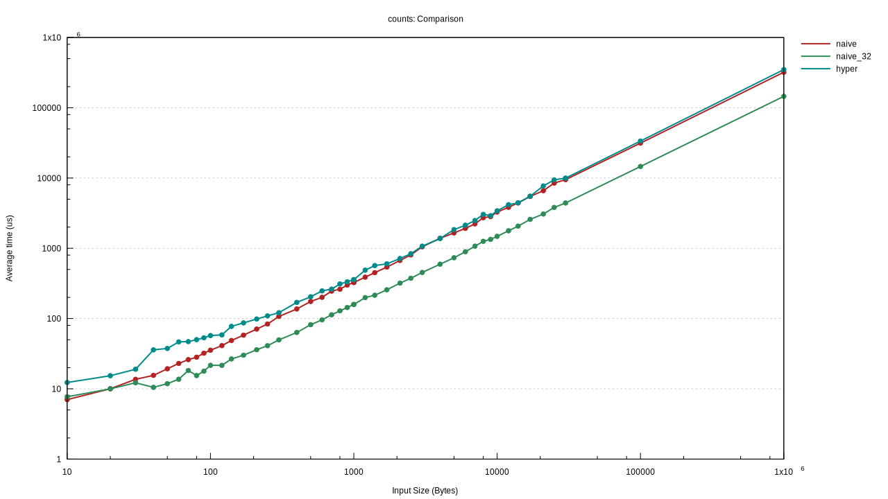

# Comparing Functions

Criterion.rs can automatically benchmark multiple implementations of a function and produce summary
graphs to show the differences in performance between them. First, lets create a comparison
benchmark. We can even combine this with benchmarking over a range of inputs.

```rust
use criterion::{criterion_group, criterion_main, Criterion, BenchmarkId};

fn fibonacci_slow(n: u64) -> u64 {
    match n {
        0 => 1,
        1 => 1,
        n => fibonacci_slow(n-1) + fibonacci_slow(n-2),
    }
}

fn fibonacci_fast(n: u64) -> u64 {
    let mut a = 0;
    let mut b = 1;

    match n {
        0 => b,
        _ => {
            for _ in 0..n {
                let c = a + b;
                a = b;
                b = c;
            }
            b
        }
    }
}


fn bench_fibs(c: &mut Criterion) {
    let mut group = c.benchmark_group("Fibonacci");
    for i in [20u64, 21u64].iter() {
        group.bench_with_input(BenchmarkId::new("Recursive", i), i, 
            |b, i| b.iter(|| fibonacci_slow(*i)));
        group.bench_with_input(BenchmarkId::new("Iterative", i), i, 
            |b, i| b.iter(|| fibonacci_fast(*i)));
    }
    group.finish();
}

criterion_group!(benches, bench_fibs);
criterion_main!(benches);
```

These are the same two fibonacci functions from the [Getting Started](../getting_started.md) page.

```rust
fn bench_fibs(c: &mut Criterion) {
    let mut group = c.benchmark_group("Fibonacci");
    for i in [20u64, 21u64].iter() {
        group.bench_with_input(BenchmarkId::new("Recursive", i), i, 
            |b, i| b.iter(|| fibonacci_slow(*i)));
        group.bench_with_input(BenchmarkId::new("Iterative", i), i, 
            |b, i| b.iter(|| fibonacci_fast(*i)));
    }
    group.finish();
}
```

As in the earlier example of benchmarking over a range of inputs, we create a benchmark group and
iterate over our inputs. To compare multiple functions, we simply call `bench_with_input` multiple
times inside the loop. Criterion will generate a report for each individual benchmark/input pair,
as well as summary reports for each benchmark (across all inputs) and each input (across all
benchmarks), as well as an overall summary of the whole benchmark group.

Naturally, the benchmark group could just as easily be used to benchmark non-parameterized functions
as well.

## Violin Plot


The [Violin Plot](https://en.wikipedia.org/wiki/Violin_plot) shows the median times and the PDF of
each implementation.

## Line Chart



The line chart shows a comparison of the different functions as the input or input size increases,
which can be enabled with ParameterizedBenchmark.

    
