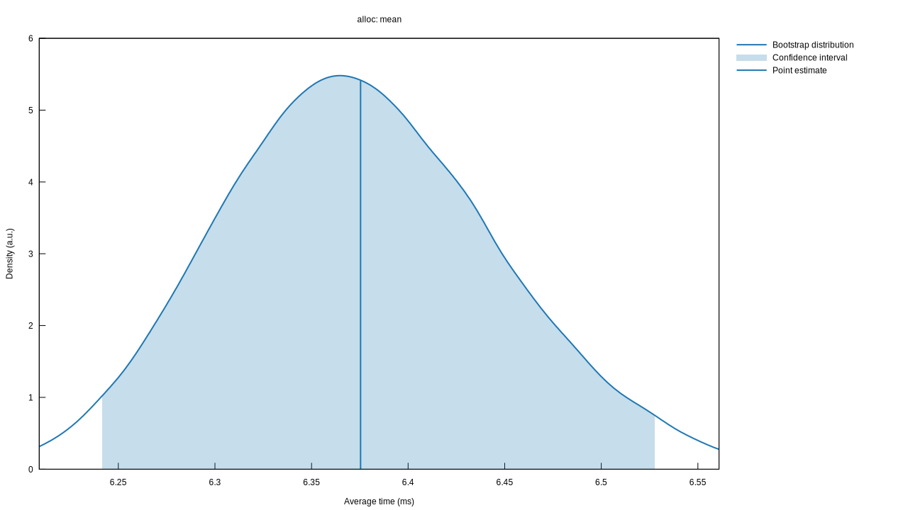
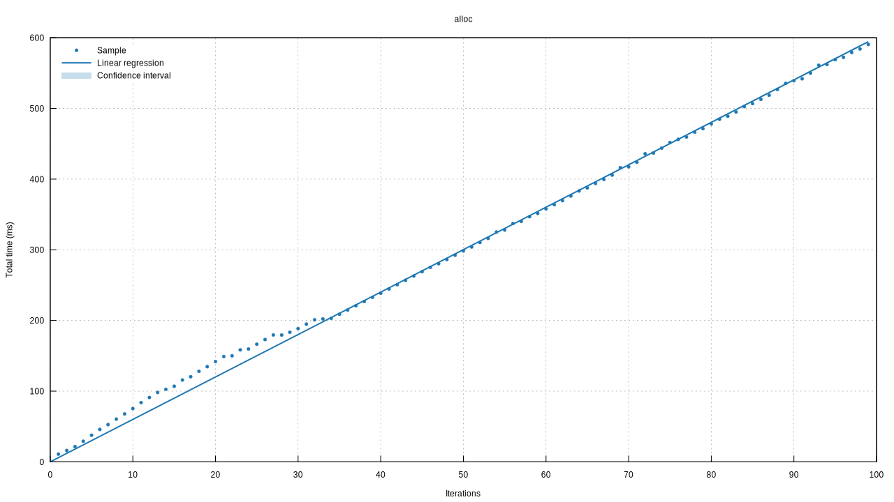
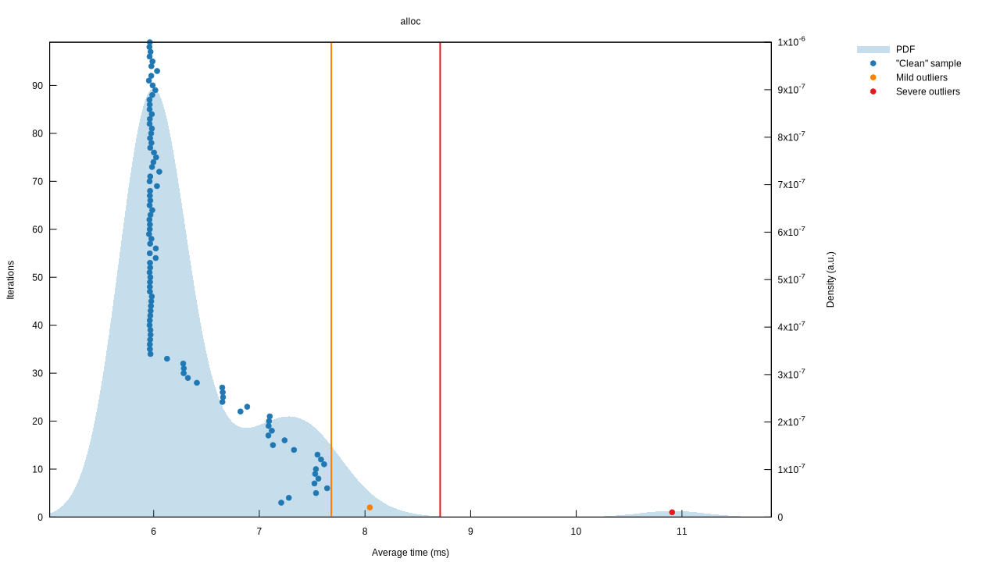

# Plots & Graphs

If [gnuplot](http://www.gnuplot.info/) is installed, Criterion.rs can generate a number of useful
charts and graphs which you can check to get a better understanding of the behavior of the
benchmark.

## File Structure

The plots and saved data are stored under `target/criterion/$BENCHMARK_NAME/`. Here's an example of
the folder structure:

```
$BENCHMARK/
├── base/
│  ├── raw.csv
│  ├── estimates.json
│  ├── sample.json
│  └── tukey.json
├── change/
│  └── estimates.json
├── new/
│  ├── raw.csv
│  ├── estimates.json
│  ├── sample.json
│  └── tukey.json
└── report/
   ├── both/
   │  ├── pdf.svg
   │  └── regression.svg
   ├── change/
   │  ├── mean.svg
   │  ├── median.svg
   │  └── t-test.svg
   ├── index.html
   ├── MAD.svg
   ├── mean.svg
   ├── median.svg
   ├── pdf.svg
   ├── pdf_small.svg
   ├── regression.svg
   ├── regression_small.svg
   ├── relative_pdf_small.svg
   ├── relative_regression_small.svg
   ├── SD.svg
   └── slope.svg
```

The `new` folder contains the statistics for the last benchmarking run, while the `base` folder
contains those for the last run on the `base` baseline (see [Command-Line
Options](./command_line_options.md#baselines) for more information on baselines). The plots are in
the `report` folder. Criterion.rs only keeps historical data for the last run. The `report/both`
folder contains plots which show both runs on one plot, while the `report/change` folder contains
plots showing the differences between the last two runs. This example shows the plots produced by
the default `bench_function` benchmark method. Other methods may produce additional charts, which
will be detailed in their respective pages.

## MAD/Mean/Median/SD/Slope



These are the simplest of the plots generated by Criterion.rs. They display the bootstrapped
distributions and confidence intervals for the given statistics.

## Regression



The regression plot shows each data point plotted on an X-Y plane showing the number of iterations
vs the time taken. It also shows the line representing Criterion.rs' best guess at the time per
iteration. A good benchmark will show the data points all closely following the line. If the data
points are scattered widely, this indicates that there is a lot of noise in the data and that the
benchmark may not be reliable. If the data points follow a consistent trend but don't match the
line (eg. if they follow a curved pattern or show several discrete line segments) this indicates
that the benchmark is doing different amounts of work depending on the number of iterations, which
prevents Criterion.rs from generating accurate statistics and means that the benchmark may need to
be reworked.

The combined regression plot in the `report/both` folder shows only the regression lines and is a
useful visual indicator of the difference in performance between the two runs.

## PDF



The PDF chart shows the probability distribution function for the samples. It also shows the ranges
used to classify samples as outliers. In this example (as in the regression example above) we can
see that the performance trend changes noticeably below ~35 iterations, which we may wish to
investigate.
